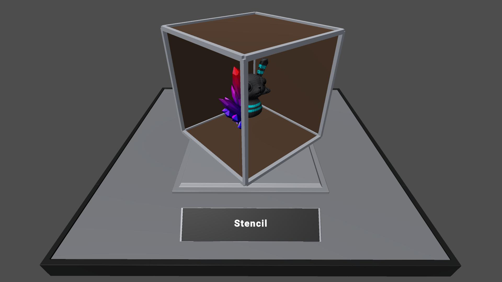
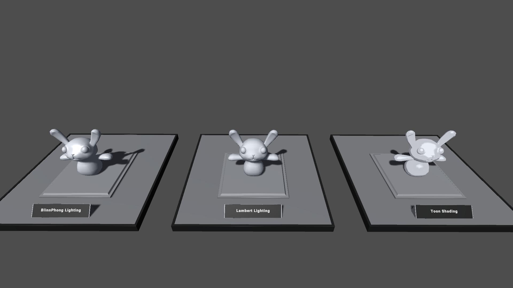
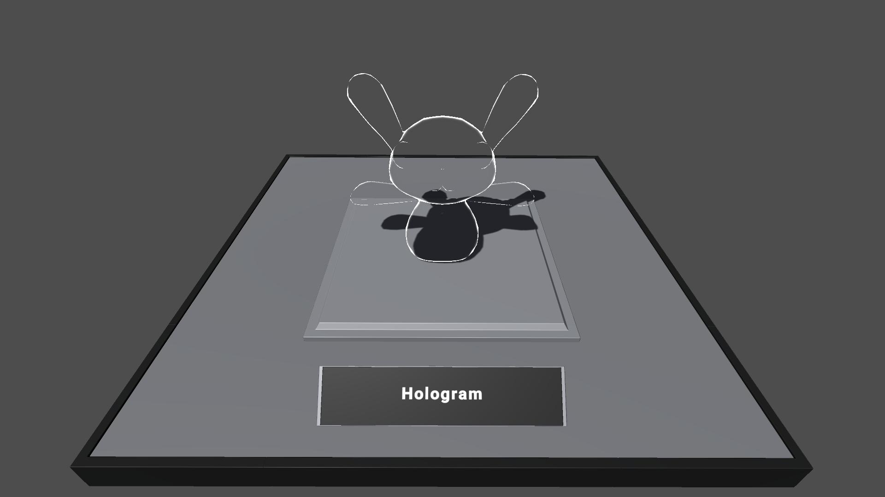
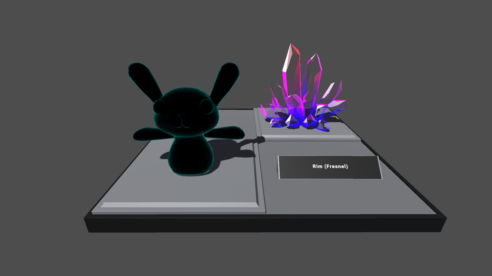
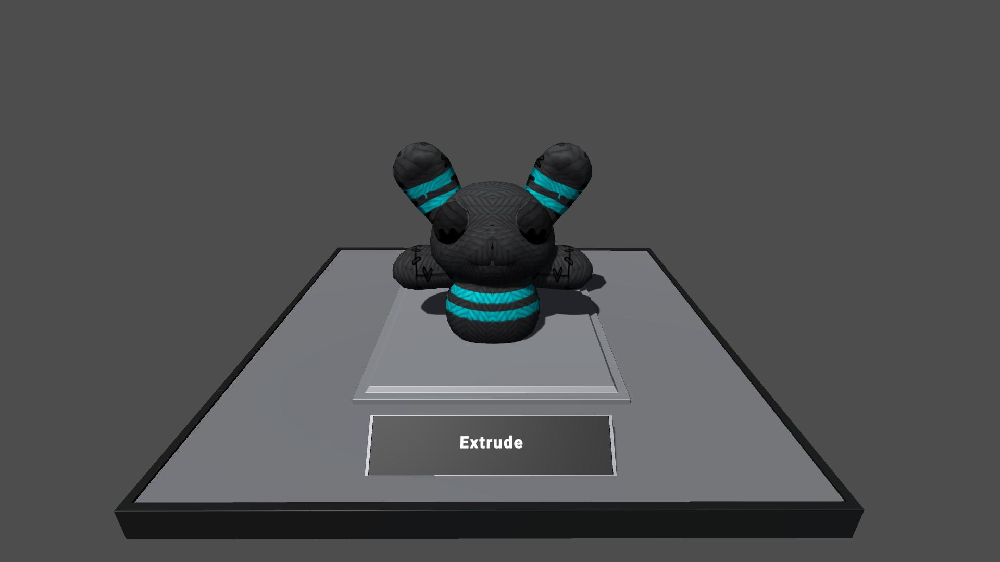
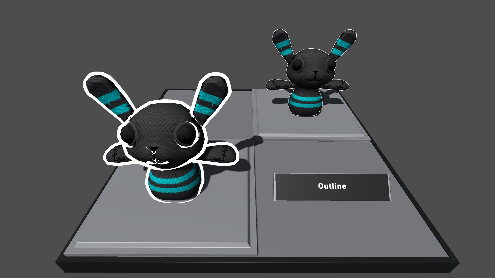
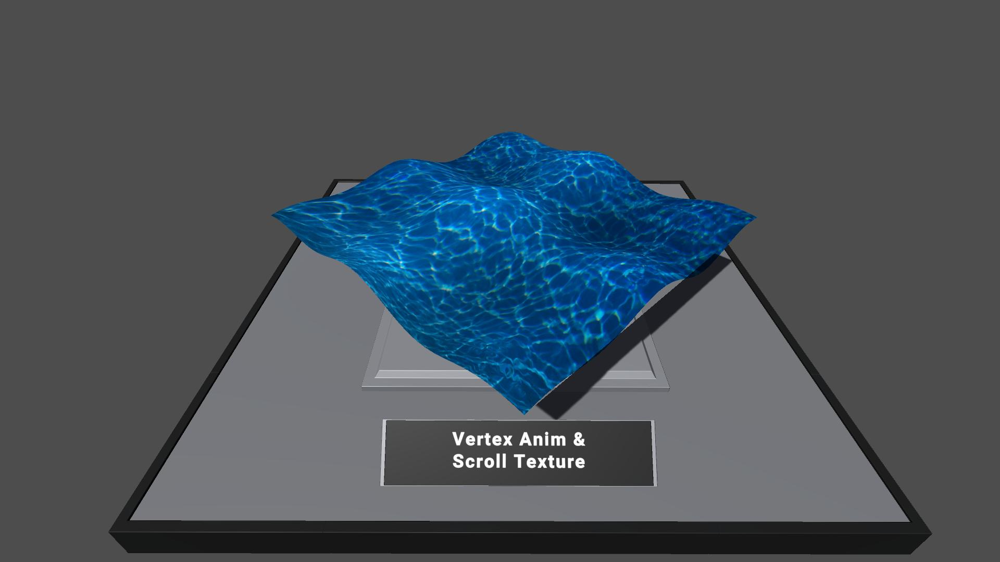

# 🎮 Unity Shader Showcase

A collection of custom shaders and visual effects built in Unity, demonstrating various rendering techniques.

---

## 📸 Preview

### 🔷 Stencil Buffer

> Sử dụng Stencil Buffer để render các object bên trong một vùng không gian giới hạn (hộp kính), tạo hiệu ứng "nhìn xuyên" có kiểm soát.

---

### 🌊 Vertex Animation & Scroll Texture

> Di chuyển vertex theo thời gian kết hợp với texture cuộn liên tục để tạo hiệu ứng mặt nước sống động.

---

### 💡 Lighting Models

> So sánh ba mô hình ánh sáng phổ biến:
> - **BlinnPhong Lighting** – Specular highlight mềm mại, phù hợp bề mặt bóng.
> - **Lambert Lighting** – Diffuse thuần túy, bề mặt mờ, tự nhiên.
> - **Toon Shading** – Đổ bóng phân bậc kiểu hoạt hình.

---

### 🌀 Rim (Fresnel)

> Hiệu ứng phát sáng viền dựa trên góc nhìn (Fresnel), tạo cảm giác phát quang từ rìa object khi nhìn từ phía trước.

---

### 📐 Extrude

> Đẩy các vertex dọc theo hướng normal trong vertex shader, tạo hiệu ứng phình to hoặc inflate toàn bộ mesh.

---

### ✏️ Outline

> Kỹ thuật vẽ viền bằng cách render một pass thứ hai với mesh phóng to và flip normal, tạo đường viền rõ nét xung quanh object.

---

### 👻 Hologram

> Kết hợp wireframe, scanline và Fresnel để tạo hiệu ứng hologram sci-fi trong suốt.

---

## 🛠️ Công nghệ sử dụng

- **Engine**: Unity (Built-in)
- **Ngôn ngữ Shader**: CG / ShaderLab
- **Scripting**: C#

